# lacture4Array

# Array
Массив (Array) в JavaScript является глобальным объектом, который используется для создания массивов; которые представляют собой высокоуровневые спископодобные объекты.

# Создание массива

 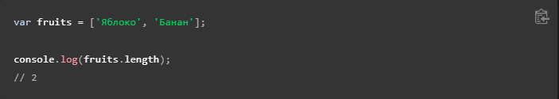

 # Доступ к элементу массива по индексу
 
 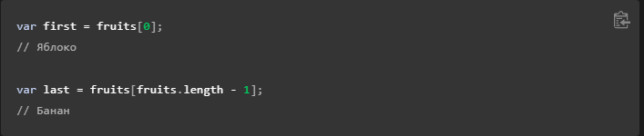

 # Итерирование по массиву
 
 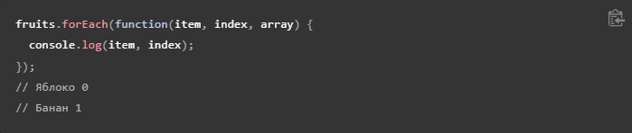

 # Добавление элемента в конец массива
 
[label](img/4.PNG%0D) [label](img/5.PNG%0D) 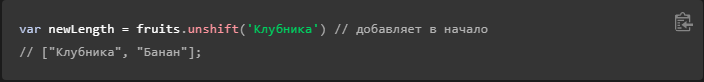

# Удаление последнего элемента массива

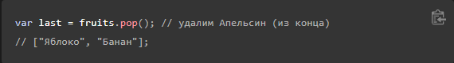

# Удаление первого элемента массива

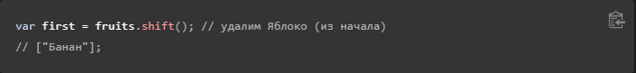

# Добавление элемента в начало массива

# Поиск номера элемента в массиве

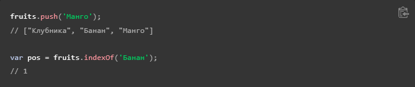

# Удаление элемента с определённым индексом

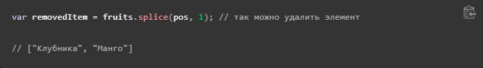

# Удаление нескольких элементов, начиная с определённого индекса

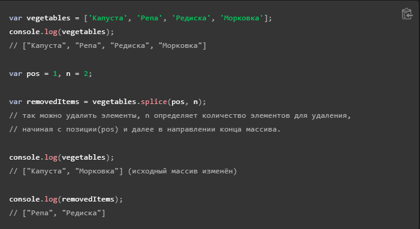

# Создание копии массива

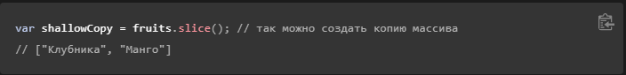

# Методы массива

# filter()
Метод filter() создаёт новый массив со всеми элементами, прошедшими проверку, задаваемую в передаваемой функции.

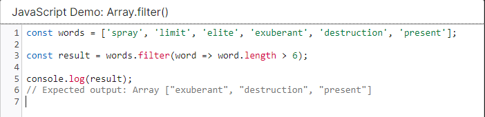

# find()
Метод find() возвращает значение первого найденного в массиве элемента, которое удовлетворяет условию переданному в callback функции. В противном случае возвращается undefined.

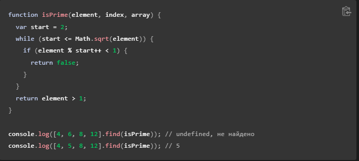

# map()
Метод map() создаёт новый массив с результатом вызова указанной функции для каждого элемента массива.

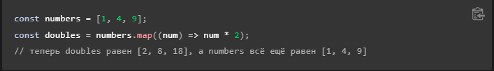

# sort()
Метод sort() на месте сортирует элементы массива и возвращает отсортированный массив. Сортировка не обязательно устойчива (англ.). Порядок сортировки по умолчанию соответствует порядку кодовых точек Unicode.

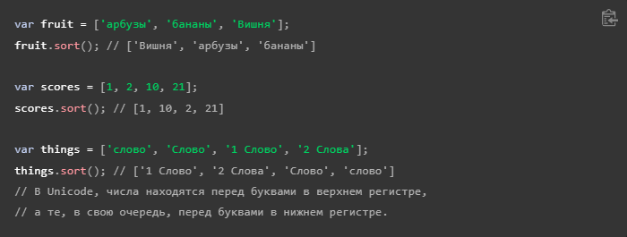

# Для числового сравнения, вместо строкового, функция сравнения может просто вычитать b из a. Следующая функция будет сортировать массив по возрастанию:

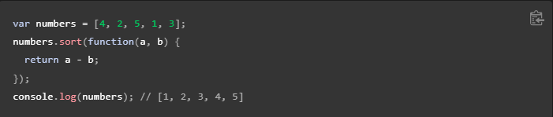

# reduse()
Метод reduce() применяет функцию reducer к каждому элементу массива (слева-направо), возвращая одно результирующее значение.

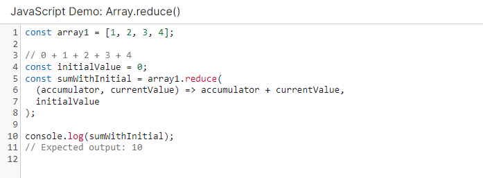

# join()
Метод join() объединяет все элементы массива (или массивоподобного объекта) в строку.

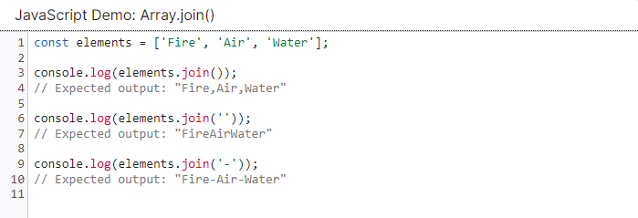

# concat
Метод concat() возвращает новый массив, состоящий из массива, на котором он был вызван, соединённого с другими массивами и/или значениями, переданными в качестве аргументов.

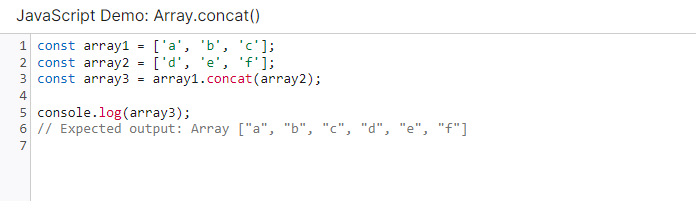
